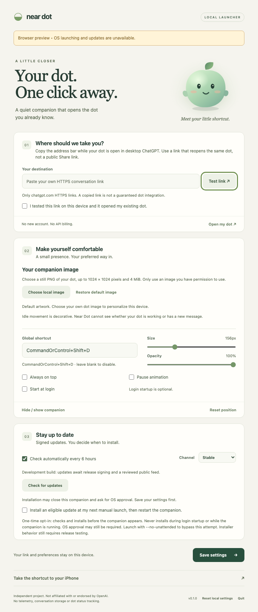

# Near Dot

An independent, local desktop companion that opens your existing dot with a click or shortcut. Phase 1 targets **Windows x64 and Mac**; the iPhone companion is an Apple Shortcuts recipe.

**Status: working development project, not cleared for public binary release.** No public release, paid signing service, account, backend or OpenAI API billing has been created. See [acceptance evidence](docs/ACCEPTANCE.md) before treating any platform as supported.



## What it does

- Original transparent seed companion, gentle animation and hover feedback.
- Optional local PNG image for your companion, with metadata stripped and no upload or profile scraping.
- Click or configurable global shortcut to launch your saved HTTPS destination in the default browser.
- Tray/menu bar access, hide/show, pause, size, opacity, always-on-top, position reset and settings.
- Opt-in login startup. Keyboard access through the settings window and tray; reduced-motion support.
- Local link validation and an explicit test-and-confirm setup flow.
- Signed update adapter with progress, errors, defer/skip, stable/preview channels and staged/paused rollout.

This is a launcher. It does not read conversations, show dot activity/unread badges, synchronize memory or sign in for you. A successful browser launch is **not proof that ChatGPT opened your dot**. Your device's Test link step establishes that. Keep the actual private conversation link out of source, screenshots, issues and releases; never use a public share link.

The official integration recheck on 4 October 2026 did not establish a public dot conversation API or stable third-party deep-link contract. General API conversation state does not grant access to an existing ChatGPT dot. Desktop ChatGPT/web and a supported mobile app are the official surfaces; mobile web is unsupported. Read the [capability matrix and sources](docs/FEASIBILITY.md).

## Run and build

Install Node **22.22.2**, Rust **1.95.0** and the [Tauri platform prerequisites](https://v2.tauri.app/start/prerequisites/). Windows needs Visual Studio C++ build tools and WebView2. Mac needs Xcode command-line tools. No API key is needed.

```sh
npm ci
npm run tauri -- dev
```

Desktop release build, unsigned development packaging:

```sh
# Windows x64, in PowerShell
npm run tauri -- build --target x86_64-pc-windows-msvc --bundles nsis

# Apple Silicon Mac
npm run tauri -- build --bundles app,dmg

# Mac executable without installer packaging
npm run tauri -- build --no-bundle
```

The unsigned Mac `.app` lives in `src-tauri/target/release/bundle/macos/Near Dot.app`; the Windows installer is under `src-tauri/target/x86_64-pc-windows-msvc/release/bundle/nsis/`. Do not distribute these unsigned development outputs as public releases or disable OS security to run them.

Browser-only visual preview (OS actions are deliberately unavailable):

```sh
npm run dev
# Open http://127.0.0.1:1420
# Companion preview: http://127.0.0.1:1420/?view=companion
```

Validation:

```sh
npm run check
npx playwright install chromium
npm run test:ui
cargo clippy --manifest-path src-tauri/Cargo.toml --locked -- -D warnings
cargo fmt --manifest-path src-tauri/Cargo.toml --check
npm audit --audit-level=moderate
cargo install cargo-audit --version 0.22.2 --locked
cargo audit --file src-tauri/Cargo.lock
python3 scripts/scan-public.py
python3 scripts/run-gitleaks.py
```

If Node cannot find a locally trusted issuer, configure `NODE_EXTRA_CA_CERTS` with your machine's verified CA bundle. Keep certificate verification enabled. This is environment setup, not a client setting.

## Set up your link

1. In a desktop browser, open your existing dot in ChatGPT, signed into the correct account/workspace. If it exposes a distinct HTTPS address, copy the browser address bar, then open that address in a fresh tab and confirm it returns to the same dot. Do not use Share or create a public link. The official guidance does not document a dedicated private-link procedure; if no address reliably reopens your dot, leave the destination unconfigured.
2. Paste it in Settings. Near Dot displays it locally, accepts only `https://chatgpt.com` and rejects credentials, query/fragment tokens, nonstandard ports, share and API paths.
3. Select **Test link**. Confirm the default browser opens your existing dot. If it opens a different conversation, a login screen or an unavailable page, leave it unconfirmed and fix access in ChatGPT.
4. Tick the test confirmation, then **Save settings**. Click the companion, **Open my dot**, the tray item or your shortcut.

Choose **Settings → Choose local image** to use a PNG of your dot that you already have permission to use. Images must be still PNGs up to 1024 × 1024 pixels and 4 MiB. The image is decoded and stored only in your per-user app directory, separate from the public project. It changes the on-screen companion, not the installed application or tray icon. No automatic avatar download or synchronization is implemented. Restore default preserves the previous image locally.

No desktop app scheme is enabled because the checked sources did not document an exact-dot launch contract. Links are per user and per device. Do not assume a desktop link works on an iPhone.

## Live messages and direct conversation

Activity animation, message snippets and talking to the existing dot from a companion panel need a documented, authorized integration. The official recheck has not established that integration. Idle animation is decorative; Near Dot has no access to dot messages or task state. [Next-phase requirements and evidence](docs/ROADMAP.md) describe the blockers and the supported contact-channel options. A separate API assistant would have different identity/history/permissions and costs; it is outside this release.

## Updates and release readiness

Automatic checks occur after 30 seconds and every six hours; disable them in Settings. A release build needs a pinned verification public key and reviewed public GitHub repository. Development builds report that updates are unconfigured. No placeholder server or key is trusted.

Package installation normally requires user action. Windows installers may close this companion and require OS approval. Mac exposes a restart action after installation. Defer hides the offer until a subsequent check; skipping suppresses that version for automatic checks, while a manual check can offer it again. Optional unattended installation is a one-time opt-in for the next manual launch, before the companion appears; login startup and a running companion never install automatically. This mode still requires signed-installer acceptance testing before public release.

See [release runbook](docs/RELEASE.md), [security policy](SECURITY.md), [privacy](PRIVACY.md), [architecture](docs/ARCHITECTURE.md) and [troubleshooting/uninstall](docs/TROUBLESHOOTING.md).

## iPhone

Follow the [documented Shortcut recipe](docs/IPHONE.md). The default label is **Open ChatGPT**, with the remaining step of selecting your dot inside the supported app. Exact dot links are conditional on actual-device verification. No iPhone tests or simulator tests were run here.

## License and support

MIT is recommended and included for code and original art. Third-party packages retain their own licenses; review the locked dependency inventory before release. Near Dot is independent and is not affiliated with or endorsed by OpenAI or Apple. Support covers this launcher's settings and updates, not ChatGPT account eligibility, service availability or dot behavior. Do not submit private conversation links or screenshots to a public issue.
